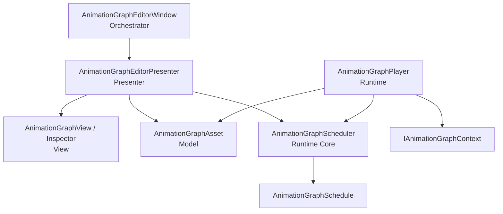

# Unity Animation Graph Technical Spec

本ドキュメントは、`com.daitokuamy.unityanimationgraph` の初期実装に向けた仕様の叩き台です。

目的は、Unity 上で直列、並列、合流、ループ、分岐を含む演出フローをノードグラフとして構築し、エディタでのシークプレビューとランタイム再生を同じ時間評価ロジックで扱えるようにすることです。

## Scope

この仕様で扱う範囲:

- ノードグラフのデータモデル
- ノードのクラス階層と評価インターフェース
- スケジューラによる時間軸展開
- ランタイム再生の責務
- エディタウィンドウ、GraphView、AnimationMode プレビューの責務
- Undo と一時状態の扱い

この仕様でまだ確定しない範囲:

- 実際の標準ノード一覧
- UI の詳細な見た目
- ノード検索、コピー、ペースト、複数選択などの編集 UX
- 独自 Blackboard 型の完全な型システム
- Playables / Timeline 連携ノードの細部

## Package Layout

Runtime assembly:

- `Packages/com.daitokuamy.unityanimationgraph/Runtime/UnityAnimationGraph.asmdef`
- `Core/`: モデルと共通インターフェース
- `Nodes/`: ノード基底と標準制御ノード
- `Scheduling/`: スケジュール構築とスケジュール結果
- `Playback/`: ランタイム再生と再生 handle
- `UnityEditor` に依存しない

Editor assembly:

- `Packages/com.daitokuamy.unityanimationgraph/Editor/UnityAnimationGraph.Editor.asmdef`
- EditorWindow、Presenter、GraphView、Inspector、AnimationMode プレビューを配置する
- Runtime assembly に依存する

基本名前空間は `UnityAnimationGraph` とし、Editor 側は `UnityAnimationGraph.Editor` を候補とする。
ただし既存実装が入るまでは、名前空間は最初の実装時に最終決定する。

## Architecture

本ライブラリは Orchestrator + MVP を基本構造にする。



### Orchestrator

`AnimationGraphEditorWindow` は EditorWindow のライフサイクルだけを管理する。

- ウィンドウ生成時に Presenter と View を生成する
- 対象の `AnimationGraphAsset` を Presenter に渡す
- `OnDisable` で Presenter にクリーンアップを委譲する
- Window 自身にはグラフ編集、スケジュール計算、AnimationMode 操作の詳細を書かない

### Presenter

`AnimationGraphEditorPresenter` は View と Model を仲介する制御層である。

- View からの操作確定イベントを受け取る
- `Undo.RecordObject` を呼んでから `AnimationGraphAsset` を更新する
- グラフ変更時に Scheduler を再ビルドする
- プレビュー開始、シーク、停止を管理する
- AnimationMode の開始、サンプリング、停止を一元管理する

### View

View は UI Toolkit と GraphView API を使って描画と入力を担当する。

- ノードのドラッグ中の座標を View 内の一時状態として保持する
- 入力中テキスト、選択状態、スクロール位置、ズーム値を View 内の一時状態として保持する
- 操作が確定したタイミングで Presenter にイベントを通知する
- Model を直接変更しない

### Model

Model は `AnimationGraphAsset` とノードデータで構成する。

- 永続化対象の値のみを持つ
- Editor 専用の表示状態や操作中の中間値を持たない
- Scheduler と Runner から参照できるよう Runtime assembly に置く

## Commit Model

アセットの書き換えは操作確定時だけ行う。

### Node Position

- ドラッグ中は GraphView 側だけで座標を保持する
- マウスアップまたは `GraphView.graphViewChanged` 相当の確定イベントで Presenter に通知する
- Presenter は `Undo.RecordObject(graphAsset, "...")` 後に最終座標を Model へ反映する
- 反映後にアセットを dirty にする

### Node Parameter

- 入力中の未確定値は UI Toolkit のフィールド側に保持する
- `UnfocusEvent`、delayed field の確定、または明示的な適用操作で Presenter に通知する
- Presenter は Undo を記録してから Model を更新する

### Graph Edge

- エッジの追加、削除、つなぎ替えも確定操作として扱う
- 接続は必ず循環チェック、型チェック、ポート制約チェックを通す
- エラー時は Model を変更しない

## Core Data Model

### IAnimationGraphBlackboard

`IAnimationGraphBlackboard` は実行時の Blackboard 値を提供する薄いインターフェースである。
ターゲットを必要としないノードや処理は、この interface だけに依存してよい。

```csharp
public interface IAnimationGraphBlackboard {
    bool TryGetBlackboardValue(string key, out bool value);
    bool TryGetBlackboardValue(string key, out int value);
    bool TryGetBlackboardValue(string key, out float value);
    bool TryGetBlackboardValue(string key, out string value);
    bool TryGetBlackboardValue(string key, out Vector2 value);
    bool TryGetBlackboardValue(string key, out Vector3 value);
    bool TryGetBlackboardValue(string key, out Color value);
    bool TryGetBlackboardValue(string key, out Vector4 value);
}
```

### IAnimationGraphContext

`IAnimationGraphContext` は実行時のターゲットバインディングと Blackboard 値を提供する。
Component を直接操作するノードはこの interface に依存する。

```csharp
public interface IAnimationGraphContext : IAnimationGraphBlackboard {
    T GetTarget<T>(string key) where T : Component;
    bool TryGetTarget<T>(string key, out T target) where T : Component;
}
```

初期実装では、例外を投げる `GetTarget<T>` と、失敗を戻り値で表す `TryGetTarget<T>` の両方を用意する。
ノード評価中は可能な限り `TryGetTarget<T>` を使い、ターゲット未設定で Unity を停止させない。

### AnimationGraphAsset

`AnimationGraphAsset` はグラフ全体を保持する `ScriptableObject` である。

保持する主なデータ:

- graph id
- graph version
- graph seed
- node list
- edge list または node ごとの next node id list
- start node id
- blackboard variable definitions (`BlackboardDefinition`, `BlackboardValueType`)
- target key definitions (`TargetDefinition`)
- editor 用の最小限の永続表示設定

ノード間参照の永続化は、Unity オブジェクト参照ではなく node id ベースを基本とする。
実行時や編集時には Resolver が node id から `Node` 参照へ解決してよい。
これにより、循環参照、コピー、削除、Undo、差分確認を扱いやすくする。

### AnimationGraphPlayer

`AnimationGraphPlayer` は `AnimationGraphSchedule` を再生する Runtime Core の純 C# クラスである。
シーン上の target key と component のバインド、Inspector 入力、Blackboard の保持は、後続で作る MonoBehaviour runner / context 側の責務とする。

責務:

- `AnimationGraphAsset` と `IAnimationGraphContext` を受け取る
- Scheduler を呼び出して `AnimationGraphSchedule` を構築する
- 再生状態、現在時刻、schedule duration を保持する
- 再生、停止、一時停止、シーク、tick による時間更新を提供する
- `Play` は再生完了を await できる `AnimationGraphPlayHandle` を返す

ランタイムの停止時は、AnimationMode のような自動巻き戻しを保証しない。
巻き戻しが必要な場合は、別途初期値キャプチャと restore オプションを設計する。

## Node Hierarchy

```text
Node
|-- ControlNode
|   |-- StartNode
|   |-- DelayNode
|   |-- JoinNode
|   |-- LoopNode
|   `-- BranchNode
`-- ActionNode
    |-- PropertyActionNode<T>
    `-- ComponentActionNode<T>
```

### INodeExecutor

すべてのノード評価は次のインターフェースに集約する。

```csharp
public interface INodeExecutor {
    float CalculateDuration(int seed, IAnimationGraphContext context);
    float CalculateDelay(int seed, IAnimationGraphContext context);
    void Evaluate(int seed, float localTime, float calculatedDuration, IAnimationGraphContext context);
    void Cancel(int seed, IAnimationGraphContext context);
}
```

`CalculateDuration` と `CalculateDelay` は Schedule build 時に呼ばれる。
`Evaluate` はランタイム再生またはエディタプレビュー時に呼ばれる。
`Cancel` は再生が中断されたとき、直前に active として評価されていたノードへ通知する。

### Node

すべてのノードの基底である。

保持する主なデータ:

- `NodeId`
- `GraphPosition`
- `NextNodeIds`
- 表示名またはメモ
- 有効、無効フラグ

`NodeId` はグラフ内で一意な安定 ID とする。
乱数シードや差分管理に使うため、生成後に意味なく変更しない。

`GraphSeed` は `AnimationGraphAsset` にシリアライズされるグラフ全体の seed とする。
通常の Scheduler build ではこの値を使い、テストや一時再生だけ別 seed にしたい場合は build 時の `overrideSeed` を使う。

Scheduler / Player がノードを評価するときは、すでに合成済みの `seed` を渡す。
seed の合成では `string.GetHashCode()` を使わない。
.NET / Unity の実行環境差やセッション差の影響を避けるため、FNV-1a などの決定的なハッシュ関数、または `Hash128` を使って graph seed、`NodeId`、loop iteration などから安定した整数を作る。

`Node` は `INodeExecutor` を明示的に実装する。
具象ノードからは protected abstract メソッドを override させ、executor API を `Node` の public surface には出さない。

明示的実装は、受け取った `seed` をそのまま protected abstract メソッドへ渡す。
seed の合成は `Node` ではなく呼び出し側で行う。
`Evaluate` の明示的実装は、最終的に次の共通処理を行ってから protected abstract メソッドへ委譲する。

- duration を 0 以上にクランプする
- duration が 0 の場合は `t = 1` として扱う
- `localTime / duration` を 0 から 1 にクランプして `t` を作る
- 派生クラスの protected abstract メソッドへ seed を渡す

`Cancel` の明示的実装は、protected virtual メソッドへ委譲する。
protected 側は no-op を既定実装とし、キャンセル処理が必要なノードだけ override する。
`Cancel` には `localTime` や duration は渡さず、`seed` と `IAnimationGraphContext` だけを渡す。

### ControlNode

制御ノードはターゲットを持たず、時間展開や分岐にだけ関与する。

#### StartNode

- グラフの開始点
- duration は 0
- delay は 0
- グラフごとに原則 1 つだけ存在する

#### DelayNode

- 後続ノードへ流すための制御点
- `Delay` を持つ
- delay は 0 以上にクランプする
- `NextNodeIds` は 1 つ以上を許可する

`NextNodeIds` による複数出力は `DelayNode` と `BranchNode` のみ許可する。
通常ノードや他の制御ノードに複数出力がある場合は build error とする。

#### JoinNode

- 複数ルートの合流点を表す
- `JoinType` を持つ

```csharp
public enum JoinType {
    All,
    Any,
}
```

`JoinType.All` は全入力のうち最も遅い end time を開始時刻にする。
`JoinType.Any` は到達した入力のうち最も早い end time を開始時刻にする。

`JoinType.Any` は後続展開の開始を早めるだけで、すでにスケジュール済みの他ルートのアクションを自動キャンセルしない。
キャンセルが必要な場合は、将来の cancellation node または lane policy として別途設計する。

#### LoopNode

- `LoopCount` を持つ
- `LoopNodeIds` を持つ
- `LoopNodeIds` はループ内容に所属するノード ID 一覧として扱う
- LoopNode に到達したら `LoopNodeIds` の内容を指定回数実行する
- loop iteration を seed に混ぜ、反復ごとの揺らぎを可能にする
- 無限ループは扱わない

`LoopCount` は 1 以上にクランプする。
1 の場合、ループ内容を 1 回実行してから LoopNode の後続へ進む。

`LoopNode.NextNodeIds` は loop 完了後の after-loop として扱う。
`LoopNodeIds` に含まれるノードは LoopNode の外側へ接続できない。
LoopNode の外側から `LoopNodeIds` に含まれるノードへ通常接続する graph は build error とする。
`LoopNodeIds` に自分自身の `NodeId` を含めた場合は build error とする。

#### BranchNode

- `BranchNode` は abstract な分岐基底ノード
- 既存の `NextNodeIds` を true 側の後続ノード ID 一覧として扱う
- `FalseNodeIds` を false 側の後続ノード ID 一覧として持つ
- `EvaluateCondition(int seed, IAnimationGraphContext context)` で true / false を判定する
- Scheduler build 時点の context / blackboard 値で進行先を確定する

BranchNode は build 時に true / false の片方だけをスケジュールへ展開する制御ノードとして扱う。
初期実装では `FlagBranchNode` を具象ノードとして用意し、`FlagKey` と `ExpectedValue` によって bool フラグを判定する。
`FlagBranchNode` は `IAnimationGraphContext.TryGetBlackboardValue(string key, out bool value)` で値を取得し、値が `ExpectedValue` と一致した場合に true 側へ進む。
`FlagKey` が空、または値を取得できない場合は warning log を出し、false 側へ進む。

### ActionNode

演出を実行するノードの基底である。

共通データ:

- `TargetKey`
- delay
- duration
- easing または custom curve
- preview enabled flag

ターゲット取得に失敗した場合の扱いは、標準ノードごとの評価ポリシーで決める。
不正なグラフ構造や必須情報の不足を Scheduler build で検出した場合は例外を投げる。

### PropertyActionNode<T>

`T : Component` の特定プロパティを書き換えるアニメーションノードの基底である。

```csharp
public abstract class PropertyActionNode<T> : ActionNode where T : Component {
    public abstract IEnumerable<string> PropertyPaths { get; }

    protected abstract void OnEvaluate(float t, float localTime, T target, IAnimationGraphContext context);
}
```

`PropertyPaths` はノード型が制御する Unity serialized property path を返す。
例: `m_LocalPosition`, `m_LocalRotation`, `m_Color`

Editor preview では、この property path を使って AnimationMode に変更対象を登録する。
Property path はアセットに保存せず、ノード型の静的な仕様として持たせる。

### ComponentActionNode<T>

`T : Component` 自体を時間駆動するノードの基底である。

```csharp
public abstract class ComponentActionNode<T> : ActionNode where T : Component {
    protected abstract void OnEvaluate(float t, float localTime, T target, IAnimationGraphContext context);
}
```

例:

- `PlayableDirector.time = localTime`
- `PlayableDirector.Evaluate()`
- ParticleSystem のシーク

この種のノードは固定の property path を持たない。
Editor preview では `AnimationMode.BeginSampling()` と `EndSampling()` の範囲内で評価し、間接的な変更を Unity に検知させる。

## Scheduler

Scheduler は `AnimationGraphAsset` を `SetGraph` で設定し、`IAnimationGraphContext` から `AnimationGraphSchedule` を構築する。
ランタイムとエディタプレビューで同じ Scheduler を使う。
通常は `AnimationGraphAsset.GraphSeed` を使うが、必要に応じて `overrideSeed` で一時的に上書きできる。

```csharp
public sealed class AnimationGraphScheduler {
    public void SetGraph(AnimationGraphAsset graphAsset);
    public AnimationGraphSchedule BuildSchedule(IAnimationGraphContext context, int? overrideSeed = null);
}
```

`SetGraph` は graph 変更時に呼び、GraphAsset 由来の静的情報を Scheduler 内部へ保持する。
`BuildSchedule` は play / preview / context 変更時に呼び、Branch 判定、delay / duration 計算、Join 到着時刻処理を行う。

### AnimationGraphSchedule

Schedule は評価に必要な情報を時刻順に保持する。

```csharp
public sealed class AnimationGraphSchedule {
    public IReadOnlyList<ScheduledNode> Nodes { get; }
    public float Duration { get; }
}
```

`ScheduledNode` が保持する主な情報:

- node reference
- start time
- duration
- seed

`EndTime` は `StartTime + Duration` で求める。
`StableOrder` は Scheduler 内部の同時刻ソート用であり、Player 向けの公開情報には含めない。

同じ時刻に複数ノードが評価される場合は、stable order で決定的に並べる。
同じ property を複数ノードが同時に書く場合は、Editor 側で authoring warning として扱う。
最終値は stable order の後勝ちになるが、意図が読みづらいため authoring warning とする。

### Build Policy

`SetGraph` と `BuildSchedule` は純粋な計算として扱う。

- `AnimationGraphAsset` を変更しない
- scene object を生成、破棄しない
- Editor API に依存しない
- 不正な入力や不正なグラフ構造は例外として扱う

`SetGraph` で扱うもの:

- node id 重複
- start node の存在と整合
- 物理接続先 node id の存在
- 物理接続の cycle

`BuildSchedule` で扱うもの:

- BranchNode の true / false 選択
- 選択済み接続に対する入次数検証
- delay / duration 計算
- JoinNode の到着時刻処理

### Cycle Detection

物理エッジは DAG として扱う。
誤接続による無限再帰を避けるため、DFS で循環を検知する。

検知方針:

- `visited` は探索完了済みノード
- `currentPath` は現在の探索スタック
- `currentPath` に再侵入した場合は cycle error とする
- cycle error がある場合、schedule build は安全に中断する

LoopNode の `LoopNodeIds` は通常の after edge ではなく、Scheduler が有限回だけ展開する loop scope として扱う。

### Serial Flow

`NextNodeIds` が 1 つの場合:

```text
nextStartTime = currentStartTime + currentDuration + nextDelay
```

### Parallel Flow

`NextNodeIds` が複数ある場合:

```text
branchBaseTime = currentStartTime + currentDuration
nextStartTime = branchBaseTime + nextDelay
```

すべての後続ノードは同じ `branchBaseTime` から始まる。

### Join Flow

Scheduler は build 前または build 中に JoinNode の入次数を把握する。
複数入力を持てるノードは JoinNode のみとし、通常ノードに複数入力が入る graph は build error とする。
Scheduler は到着時刻の早い順にノードを展開する。

`JoinType.All`:

- すべての入力 end time が揃うまで後続展開しない
- JoinNode の start time は入力 end time の最大値

`JoinType.Any`:

- 最初に到達できる入力 end time で後続展開する
- JoinNode の start time は入力 end time の最小値
- 遅れて到達する入力は後続展開には使わない

### Loop Flow

LoopNode に到達したら、`LoopCount` を body の合計実行回数として扱う。
body は `LoopNodeIds` に含まれるノード集合として扱う。
body 内で入力を持たないノードを iteration start node として展開する。

loop する場合:

- `LoopNodeIds` の node set を独立した schedule scope として展開する
- iteration は body scope 内のすべての到達可能ノードが終了した時点で終了する
- body node が LoopNode の外側へ接続する場合は build error とする
- LoopNode の外側から body node へ通常接続する場合は build error とする
- 次 iteration は前 iteration の body scope end time から始める
- seed に iteration index を混ぜる

LoopNode の後続ノードは、全 loop iteration の終了後に展開する。
Loop body は iteration ごとに独立した schedule scope として扱い、JoinNode の到着状態と BranchNode の判定は iteration ごとに分離する。

### Branch Flow

BranchNode は build 時点で true / false の片方を選ぶ。
Player は Scheduler が確定したスケジュールに従って Evaluate を呼ぶだけにする。

初期実装では `FlagBranchNode` が bool フラグを評価し、`EvaluateCondition` の結果に応じて true / false の後続ノードを選ぶ。

## Runtime Playback

`AnimationGraphPlayer` は schedule を再生する。

基本 API 候補:

```csharp
public sealed class AnimationGraphPlayer {
    public AnimationGraphAsset GraphAsset { get; }
    public IAnimationGraphContext Context { get; }
    public AnimationGraphSchedule Schedule { get; }
    public AnimationGraphPlayerState State { get; }
    public bool IsPlaying { get; }
    public float CurrentTime { get; }
    public float Duration { get; }
    public void SetGraph(AnimationGraphAsset graphAsset);
    public void SetContext(IAnimationGraphContext context);
    public void RebuildSchedule(int? overrideSeed = null);
    public AnimationGraphPlayHandle Play();
    public void Pause();
    public void Stop();
    public void Seek(float time);
    public void Tick(float deltaTime);
}
```

`AnimationGraphPlayHandle` は awaitable かつ `IEnumerator` とする。
自然完了した場合は `await handle` が `true` を返し、`Stop` や graph / context の差し替えで中断された場合は `false` を返す。
Coroutine では `StartCoroutine(player.Play())` のように再生完了まで待機できる。
また、取得した handle に対応する再生だけを `Pause` / `Resume` / `Stop` / `Complete` で操作できる。
handle が古い、完了済み、または無効な場合、操作メソッドは `false` を返す。

```csharp
public readonly struct AnimationGraphPlayHandle : IEnumerator {
    public bool IsValid { get; }
    public bool IsDone { get; }
    public bool IsCompleted { get; }
    public bool IsInterrupted { get; }
    public bool Complete();
    public bool Pause();
    public bool Resume();
    public bool Stop();
    public Awaiter GetAwaiter();
}
```

`AnimationGraphRunner` は scene 上の `MonoBehaviour` として target binding と Blackboard 現在値を保持し、`AnimationGraphPlayer` を Unity lifecycle へ接続する。
`UpdateType` は `AnimationGraphRunner` の inner enum とし、外部 API では `UpdateMode` プロパティから切り替える。

```csharp
public sealed class AnimationGraphRunner : MonoBehaviour, IAnimationGraphContext {
    public enum UpdateType {
        Update,
        LateUpdate,
        ManualUpdate,
    }

    public AnimationGraphAsset GraphAsset { get; set; }
    public AnimationGraphTargetSchema TargetSchema { get; set; }
    public UpdateType UpdateMode { get; set; }
    public IReadOnlyList<TargetBinding> TargetBindings { get; }
    public IReadOnlyList<BlackboardValue> BlackboardValues { get; }
    public AnimationGraphPlayHandle Play();
    public AnimationGraphPlayHandle Play(AnimationGraphAsset graphAsset);
    public void Pause();
    public void Stop();
    public void ManualUpdate(float deltaTime);
    public void SetGraph(AnimationGraphAsset graphAsset);
    public void SetTargetSchema(AnimationGraphTargetSchema targetSchema);
    public bool IsTargetSchemaCompatible(AnimationGraphAsset graphAsset);
    public bool SetTarget(string key, Component target);
    public T GetTarget<T>(string key) where T : Component;
    public bool TryGetTarget<T>(string key, out T target) where T : Component;
    public bool SetBlackboardValue(string key, bool value);
    public bool SetBlackboardValue(string key, int value);
    public bool SetBlackboardValue(string key, float value);
    public bool SetBlackboardValue(string key, string value);
    public bool SetBlackboardValue(string key, Vector2 value);
    public bool SetBlackboardValue(string key, Vector3 value);
    public bool SetBlackboardValue(string key, Color value);
    public bool SetBlackboardValue(string key, Vector4 value);
}
```

`AnimationGraphRunner` は1つの `AnimationGraphTargetSchema` と、それに対応する `TargetBinding` 一覧を保持する。
`AnimationGraphAsset` とRunnerの `TargetSchema` は同じアセット参照でなければならない。
同じSchemaを参照するGraphへ切り替えた場合、RunnerのTarget Bindingは維持される。

再生中は現在時刻にアクティブな scheduled node を評価する。

```text
active if startTime <= currentTime <= endTime
localTime = currentTime - startTime
```

duration が 0 のノードは、開始時刻に一度だけ評価する。
ランタイム再生でフレームをまたいで開始時刻を通過した場合は、前回時刻と今回時刻の区間に含まれる 0 duration node を評価する。

`Stop`、`SetGraph`、`SetContext` などで再生が中断された場合、Player は直前の評価で active だった non-zero duration node にだけ `Cancel` を通知する。
まだ開始していない node や、すでに自然終了した node はキャンセル対象にしない。

## Editor Preview

Editor preview は Presenter が管理する。

### Preview Lifecycle

1. Preview start
2. Schedule build
3. Property animation nodes から property path を収集
4. 必要に応じて AnimationMode を開始
5. Slider / scrubber の値に応じて schedule を評価
6. Preview stop または window close で AnimationMode を停止

### AnimationMode Sampling

シーク時の評価は次の流れにする。

```csharp
void EvaluatePreview(float graphTime, IAnimationGraphContext context) {
    if (!AnimationMode.InAnimationMode()) {
        AnimationMode.StartAnimationMode();
    }

    RegisterPropertyModificationsForSchedule();

    AnimationMode.BeginSampling();
    EvaluateActiveNodes(graphTime, context);
    AnimationMode.EndSampling();

    SceneView.RepaintAll();
}
```

Property animation node は、対象 component と property path を AnimationMode に事前登録する。
Component action node は BeginSampling / EndSampling の範囲内で component のシーク処理を実行する。

これにより、Timeline などが内部で子オブジェクトの Transform を書き換えた場合も、Unity の sampling によってプレビュー変更として扱える。

### Cleanup

次のタイミングで必ず preview を停止する。

- `AnimationGraphEditorWindow.OnDisable`
- Preview stop button
- 対象 asset の変更
- domain reload 前後で Presenter が破棄される場合

停止時は `AnimationMode.StopAnimationMode()` を呼び、シーンの状態をプレビュー開始前へ戻す。

## Error Handling

Scheduler は不正な `AnimationGraphAsset` を build した場合に例外を投げる。
Editor 側は必要に応じて例外を捕捉し、UI 表示へ変換する。

主な例外ケース:

- start node がない
- start node が複数ある
- node id が重複している
- next node id が存在しない
- cycle がある
- JoinNode 以外のノードに複数入力がある
- JoinNode の入次数が 0
- target key が未定義
- target component が見つからない
- duration または delay が不正値
- 同時刻に同一 property へ複数 node が書き込む

## Testing Strategy

初期実装では EditMode test を中心に Scheduler と Model を検証する。

優先テスト:

- serial flow の start / end time
- parallel flow の同時開始
- JoinType.All の最大 end time 合流
- JoinType.Any の最小 end time 合流
- cycle detection
- LoopNode の inline expansion
- BranchNode の true / false 選択
- duration 0 node の評価
- missing target の warning
- deterministic seed generation

Editor 側は次を確認する。

- node drag 中に asset が dirty にならない
- drag 確定時だけ Undo が積まれる
- preview stop で AnimationMode が停止する
- preview 中の値変更が asset に保存されない

## Initial Implementation Order

1. Runtime data model
2. Scheduler result と例外ケース
3. 基本制御ノード
4. `AnimationGraphPlayer` の manual seek 再生
5. Property animation node の最小実装
6. EditorWindow + Presenter + GraphView skeleton
7. Undo commit flow
8. AnimationMode preview
9. Loop / Branch の UI
10. PlayableDirector など component action node

## Target Collection and Iteration Scope

### Target multiplicity

- `TargetDefinition` は `Single` または `Collection` の multiplicity を持つ
- `Single` binding は従来どおり 1 件の `Component` を保持する
- `Collection` binding は順序付きの `Component` 一覧を保持し、重複と null を許可する
- Runtime API は Collection に対する `SetTargets`、`AddTarget`、`RemoveTarget`、`ClearTargets`、`TryGetTargets` を提供する
- `RemoveTarget` は最初に一致した要素だけを削除する

### Collection scheduling

- Collection の反復は専用の ForEachNode を持たず、`LoopNode` の Collection count source で表現する
- Collection は schedule build、すなわち再生開始時に snapshot する
- 再生中の Collection 変更は現在の schedule に反映せず、次回の schedule build から反映する
- 空 Collection の body は 0 回実行する
- null 要素は既定で通常の反復として扱う
- `Skip Null Items` が有効な場合だけ count target の null 要素をスキップする
- ActionNode は既定で null target の処理をスキップする
- null target を必要とする特殊な ActionNode だけ基底クラスの opt-in を有効にする

### Scoped target reference

- ActionNode は文字列 key ではなく `TargetReference` を保持する
- 通常 binding は `Binding/<TargetKey>` と表示する
- 反復中の Collection 要素は `CollectionItem/<CollectionTargetKey>` と表示する
- Collection item 参照は Collection key に加えて、提供元の反復ノードの `ScopeNodeId` を保持する
- ActionNode は最も内側だけでなく、任意の祖先反復 scope を参照できる
- 同名 Collection がネストする場合、Editor は `Nearest`、`Outer 1` の補足を表示する
- schedule node は不変の反復 scope chain を共有し、内側 scope から親 scope を探索して反復 index を解決する
- Collection 要素が null、または反復 index が Collection の範囲外の場合は、既定で ActionNode の処理をスキップする
- 保存済み `ScopeNodeId` が削除済み、反復 scope provider 以外、または ActionNode の祖先でない場合、その参照は無効とする
- Graph 構成変更時に無効参照を別の祖先 scope へ自動的に付け替えない
- Editor は無効参照を `Missing Scope` と表示し、Scheduler は schedule build 前の検証で拒否する

### Loop scheduling with collection

- `LoopNode` は `Fixed` または `Collection` の count source を持つ
- `StartIndex` は 0 以上とし、各反復の Collection item index は `StartIndex + iteration` とする
- `Fixed` は `StartIndex` から `LoopCount` 回実行し、Collection の範囲外でも反復自体は継続する
- `Collection` は指定 Collection の `max(0, Count - StartIndex)` 回実行する
- `Collection` の Collection target が未 binding の場合は schedule build error とする
- `Skip Null Items` で反復を省略しても index は詰めず、別 Collection との index 対応を維持する
- Collection snapshot は schedule build 内で共有し、参照結果を一貫させる

### Scoped control extension

- body scope を所有する制御ノードは `ScopedControlNode` を継承する
- body scope に反復 index を公開するノードは `IIterationScopeProvider` を実装する
- body の接続、隔離検証、複製処理は `ScopedControlNode` の仕組みを使用する
- 反復回数や要素選択方法など、各ノード固有の schedule 展開方法は個別に実装する

## Open Questions

- ノードの永続化を完全に managed reference にするか、ScriptableObject sub asset にするか
- LoopNode の body edge UI をどう表現するか
- BranchNode の条件指定モデルをどう表現するか
- Runtime stop 時に変更値を復元するオプションを持つか
- GraphView API を継続利用するか、将来の Graph Tools Foundation へ移行可能な抽象を置くか
- Blackboard value の対応型をどこまで初期実装に含めるか
